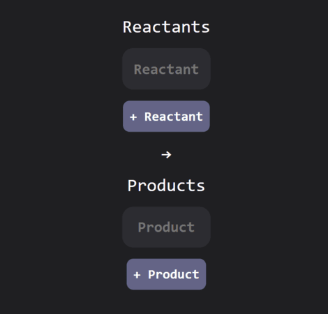

# Mole-Cule
A fast web-based chemistry tool for performing molecular calculations faster and with fewer errors. I built it because I wanted a tool that I could use as help when doing chemstry problems, since they are either really repetitive or take a lot of unecessary time. I also made it to learn new stuff, e.g taking mass percents and knowing how to turn them into a formula and balancing equations using matrices instead of trial and error. I have also gotten Much better at coding.

[Website](https://rasmusstenlund.github.io/Mole-Cule/) | [API Docs](https://molecule.nordicpine.hackclub.app/docs)

### What it does
Mole-Cule is designed to assist with solving chemical problems. 
It includes five tools for:

- **Analyzing** molecular compounds
- **Converting** between mass and moles
- **Balancing** chemical equations
- Calculating **empirical** and optional molecular formula with support for hydrates
- Calculating the **limiting** reactant, excess remnants and theoretical yields

### Features
- Custom built equation maker
- Automatically generated mol inputs in the limiting tool
- Designed for fast inputs and ease of use



### How it works
Mole-Cule uses a custom-built FastAPI API as the backend calculator and a SPA (Single-Page-Application) as the frontend.

## Installation

### Prerequisites
- Python 3.10+

## Backend setup
```bash
cd app

python -m venv venv
source venv/bin/activate

pip install -r requirements.txt

uvicorn main:app --reload
```
## Frontend setup
This project was made in vanilla HTML, JavaScript and CSS, so only local server setup is needed.

```bash
cd docs
python -m http.server
```
